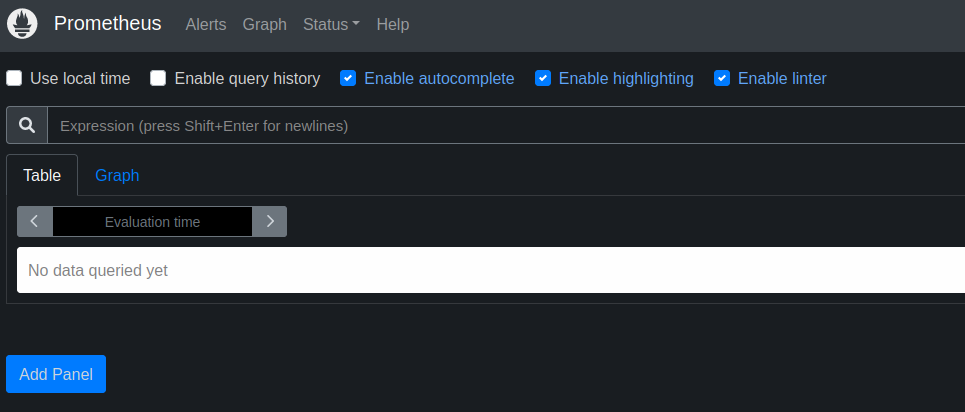
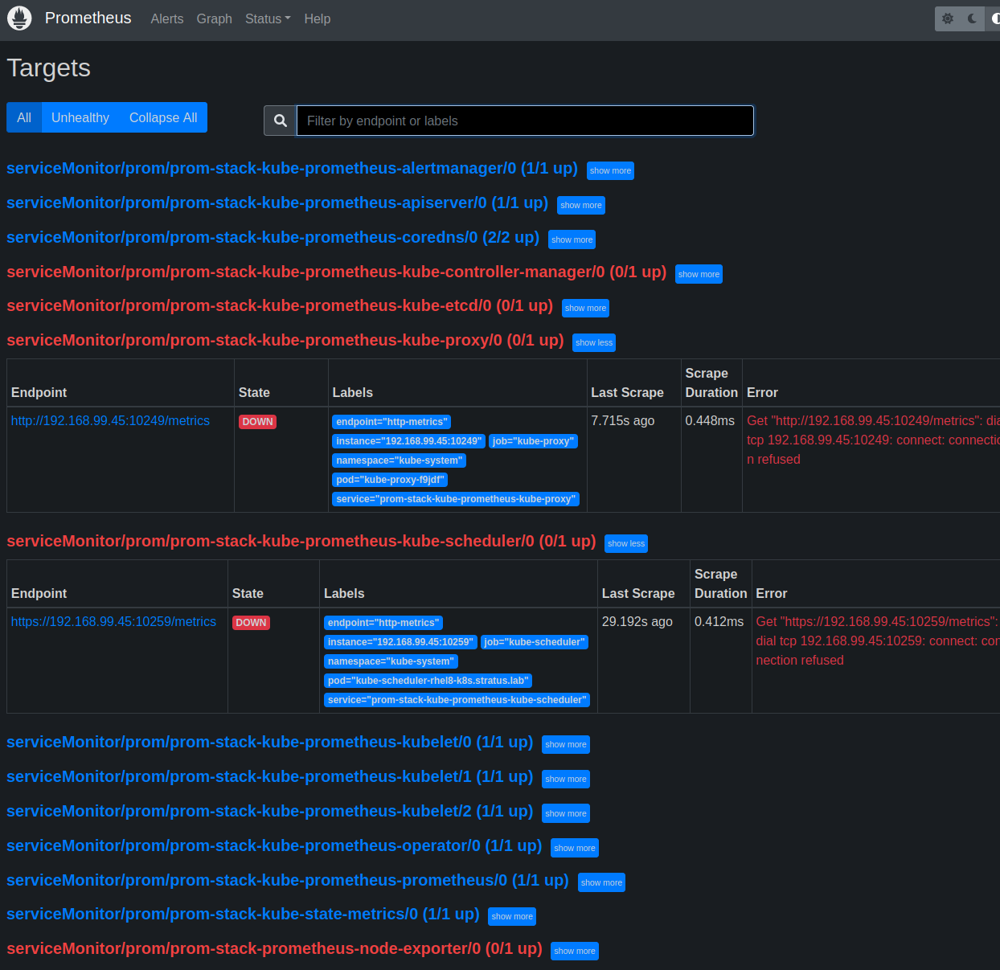

# Intro

Having a cluster is great. After completing the installation on a RHEL 8 host, the cluster is up and ready for additional configuration. One of the first things you want to know after deploying a cluster is: is the cluster healthy. For that you need to install the monitoring stack. 

> **Note**
>  This will install Prometheus and Grafana but you still need additional components to handle any alerts generated by the cluster.

> **Warning**
> The following is a lab-style document. As such, you should not expect everything to work immediately. There will be some investigation involved.
{.is-danger}


## Install Kube-prometheus-stack

The installation of the stack can be done with a **community** provided helm chart with the following commands:

```
helm repo add prometheus-community https://prometheus-community.github.io/helm-charts
helm repo update
kubectl create ns prom
helm install --namespace prom prom-stack prometheus-community/kube-prometheus-stack
```

To view the installation progress you can get a list of the pods in the `prom` project:

```
kubectl get pods -n prom
```

> **Note**
> In Kubernetes, most objects are created in a specific namespace. In order to view them you need to pass in the `-n` or `--namespace` flag along with the name of the namespace. You can also alias a command:
>```
>alias kubecon='kubectl config set-context --current --namespace '
>```
> and then switch your Kubernetes context by running the command `kubecon <namespace>`. Once you have switched contexts, the `kubectl` command will assume your current namespace unless otherwise specified.


If you have waited for a few minutes and nothing appears to be happening try running the following command:

```
kubectl get events --sort-by='.lastTimestamp'
```

This will provide a general overview as to what may be happening in your namespace. If everything is working correctly, you can move on to creating some Ingress Rules. If not, try to ascertain what the problem might be.

If you need to start over, you can run the following command:

```
helm uninstall prom-stack -n prom
```


## Create Ingress Rules

The helm chart creates a bunch of the resources we need in order to stand up the pods. If you run `kubectl get all -n prom` you will see the following resource types:

* pod
* service
* daemonset
* deployment
* replicaset
* statefulset 

By default K8S resources will communicate inside of the cluster only. They do so using the `service` resource which maps a cluster ip and port to a specific pod. In order to access the resources from outside of the cluster you will need to create a route via the Ingress Controller. In this case we installed HAProxy as the ingress controller. See if you can figure out the way the ingress rules work from the below example (all of the examples below will work as long as we have a wildcard dns server that points k3s.lab to our k8s node).

```
kubectl --namespace prom create ingress grafana\
  --annotation kubernetes.io/ingress.class=haproxy\
  --rule="grafana.k3s.lab/*=prom-stack-grafana:80,tls"


kubectl --namespace prom create ingress alertmanager\
  --annotation kubernetes.io/ingress.class=haproxy\
  --rule="alerts.k3s.lab/*=prom-stack-kube-prometheus-alertmanager:9093,tls"


kubectl --namespace prom create ingress prom-k8s\
  --annotation kubernetes.io/ingress.class=haproxy\
  --rule="prom-k8s.k3s.lab/*=prom-stack-kube-prometheus-prometheus:9090,tls"
```

If you curl the ingress you just created you should see a positive response:

```
[root@rhel8-k8s ~]# curl -ks https://prom-k8s.k3s.lab
<a href="/graph">Found</a>.
```

However, if you try from a browser:


What do you think the problem is? Containers and Kubernetes are not magic! Do not forget your traditional linux administration troubleshooting!


## Explore the Prometheus UI

Once the connection to the pod has been confirmed you should be able to access Prometheus' web UI:



Navigate to the Targets section of Prometheus and ensure that Prometheus is configured correctly:




Unfortunately it looks like the following services are having connection problems:

* ETCD Metrics
* Kube Scheduler
* Kube Proxy
* Kube Controller Manager

The problem is related to how the cluster was configured. Consider revisiting the installation instructions for any hints that you can use to resolve this problem. Some official documentation is useful. 

The kubeadm config api is [here](https://kubernetes.io/docs/reference/config-api/kubeadm-config.v1beta2/).
The general kubeadm page is [here](https://kubernetes.io/docs/reference/setup-tools/kubeadm/kubeadm-config/)

If you accidently mess things up or need to reset the cluster, kubernetes can be uninstalled with the following command:

```
kubeadm reset
```

If you do need to reset your environment, after you have run `kubeadm --init` command, you can run the [post-install.sh](https://github.com/stratus-ss/k8s-tools/blob/main/k8s_install_scripts/post-install-setup.sh) script from my github.

### Fixing Remaining Prometheus Problems

At this point you have likely solved the Kube Scheduler, Proxy and Controller Manager issues. The UI likely shows the following problems


There are two problems remaining. One related to the cluster setup somehow (ETCD) and one component (node-exporter) that is controlled via the helm chart we are using.

For the ETCD problem, look closely at the ENDPOINT in the UI and see if you can identify the problem.

For the Node Exporter, assume that the helm chart installed and configured the component correctly. Use the same troubleshooting skills you used earlier in this lab to identify and fix the problem.

> **Note**
> Neither of these problems requires a reinstallation of kubernetes


## Hints and Answers

<details>
  <summary><b>Hint Section</b></summary>
  	<details>
      <summary><b>HINT 1: Untolerated Taint</b></summary>
      In order to examin the tains on a node you can run

  ```
      kubectl describe node rhel8-k8s.k3s.lab |grep Taint
  ```

  </details>
  <details>
    <summary><b>SPOILER 1: Untolerated Taint</b></summary>
    Examining the events in the namespace shows the problem as seen below.  The output indicates that we need to remove the taint from our nodes. This is generally something you do in a constrained cluster. In a normal production sized cluster you would likely not have this specific problem. The second command below will remove the taint
    
```
   kubectl get events --sort-by='.lastTimestamp'
LAST SEEN   TYPE      REASON             OBJECT                                                  MESSAGE
103s        Warning   FailedScheduling   pod/prom-stack-kube-prometheus-admission-create-6dvv5   0/1 nodes are available: 1 node(s) had untolerated taint {node-role.kubernetes.io/control-plane: }. preemption: 0/1 nodes are available: 1 Preemption is not helpful for scheduling.
 
kubectl taint nodes --all node-role.kubernetes.io/control-plane-
``` 
  </details>
  <details>
    <summary><b>HINT 2: Troubleshoot Browser Connection</b></summary>
    If you can connect to the service from inside of the cluster, you know that the pod and software is working correctly. The connection problem is between your VM and your host. Assuming the host can connect properly to the VM (ssh for example), you could try investigating whether or not you can connect to the vm. You could also check what services are accessible from the host.
  </details>
  <details>
    <summary><b>SPOILER 2: Troubleshoot Browser Connection</b></summary>
    You can try scanning the ports with something like *nmap* from your laptop or an external host. You should discover that port 80 **and** 443 are missing from the scan. Open them in the firewall and try again. You should now be able to connect from your browser.
		For RHEL based systems:
    
```
sudo firewall-cmd --zone=public --add-service=https --permanent
sudo firewall-cmd --zone=public --add-service=http --permanent
sudo firewall-cmd --reload
```
    
For Ubuntu:

```
sudo ufw allow 443/tcp
sudo ufw allow 80/tcp
```
  </details>
	<details>
    <summary><b>HINT 3: Reinstall Kubernetes</b></summary>
    During the installation of K8S, our config file had a decent amount of information set in it that we needed to be successful, including setting the <b>listen-metrics-url</b> to listen on any interface <b>0.0.0.0</b>. The default for the the <b>listen-</b> options is to listen on local host. As you saw in the prometheus web interface, the controller-manager, the kube-proxy and the scheduler all are not reporting properly. That is because they are still bound to local host. See if you can find the options to bind these to <b>0.0.0.0</b> inside of your <b>kubeadmcfg.conf</b> file.
  </details>
  <details>
    <summary><b>Spoiler3: Completed kubeadmcfg.conf</b></summary>
    Below is the kubeadmcfg with the proper options included.
    
```
apiVersion: "kubeadm.k8s.io/v1beta3"
kind: InitConfiguration
nodeRegistration:
    name: rhel8-k8s.k3s.lab
localAPIEndpoint:
    advertiseAddress: 192.168.99.45
---
apiVersion: "kubeadm.k8s.io/v1beta3"
kind: ClusterConfiguration
etcd:
  local:
    serverCertSANs:
    - "192.168.99.45"
    peerCertSANs:
    - "192.168.99.45"
    extraArgs:
      initial-cluster: rhel8-k8s.k3s.lab=https://192.168.99.45:2380
      initial-cluster-state: new
      name: rhel8-k8s.k3s.lab
      listen-peer-urls: https://192.168.99.45:2380
      listen-client-urls: https://192.168.99.45:2379
      advertise-client-urls: https://192.168.99.45:2379
      initial-advertise-peer-urls: https://192.168.99.45:2380
      metrics: extensive
      listen-metrics-urls: http://0.0.0.0:2381
apiServer:
   extraArgs:
     authorization-mode: Node,RBAC
   timeoutForControlPlane: 4m0s
networking:
   dnsDomain: cluster.local
   podSubnet: 10.16.0.0/16
   serviceSubnet: 10.96.0.0/12
controllerManager:
    extraArgs:
      bind-address: 0.0.0.0
scheduler:
    extraArgs:
      bind-address: 0.0.0.0
---
apiVersion: "kubeproxy.config.k8s.io/v1alpha1"
kind: KubeProxyConfiguration
metricsBindAddress: 0.0.0.0
```
  </details>
 <details>
  <summary><b>Hint 4: ETCD Metrics Port</b></summary>
  Most helm charts can have their values overridden in an external file. In this case, there is a mismatch between the port that the helm chart expects ETCD metrics and where the kubeadm command installs them. Adjust the port that the helm chart is polling.
</details>
<details>
  <summary><b>SPOILER 4: ETCD Metrics Port</b></summary>
  The contents of the helm chart over rides have the following conent and the subsequent commands to reinstall the helm chart are below, don't forget to open the firewall port as well!
  
```
kubeEtcd:
  enabled: true
  service:
    enabled: true
    port: 2381
    targetPort: 2381
```

```
#if you need to remove the helm chart run the following
helm uninstall --namespace prom prom-stack
kubectl create ns prom
helm install   --namespace prom prom-stack -f prom_custom_values.yaml   prom-stack prometheus-community/kube-prometheus-stack
```

The firewall on RHEL based systems:

```
sudo firewall-cmd --zone=public --add-port=2381/tcp --permanent
sudo firewall-cmd --reload
```

For Ubuntu:

```
sudo ufw allow 2381/tcp
```

  </details>
  <details>
    <summary><b>Hint 5: Node Exporter</b></summary>
    Try connecting to the node exporter from the kubernetes host. If you can connect to the service from inside of the cluster, you know that the pod and software is working correctly. The solution for this problem is similar to another problem you had earlier.
  </details>
  <details>
    <summary><b>SPOILER 5: Node Exporter</b></summary>
    As with the browser connection problem, the issue is with the firewall. You need to open port 9100 so that prometheus can connect to the node-exporter

For RHEL based systems:
    
```
sudo firewall-cmd --zone=public --add-port=9100/tcp --permanent
sudo firewall-cmd --reload
```

For Ubuntu:

```
sudo ufw allow 9100/tcp
```
  </details>
